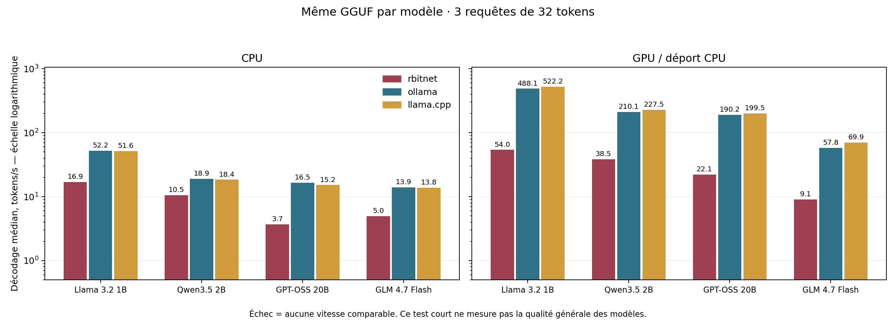

# Inférence native corrigée — 3 octobre 2026

**Les quatre GGUF du benchmark fonctionnent maintenant dans Rbitnet, en CPU et en CUDA.** Qwen3.5, GPT-OSS et GLM ne retombent plus sur un graphe Llama incompatible. Les appels HTTP ordinaires utilisent le template de conversation du GGUF, et les réponses arrivent aussi en streaming. Le débit de Llama progresse d'environ **×10,6 en CPU et ×12,9 en CUDA** par rapport au [benchmark initial](../2026-10-03/README.md).

Les mesures confirment une inférence utilisable sur ces exports, avec les limites de qualité des modèles. **Rbitnet reste moins rapide qu'Ollama et llama.cpp.** Cette livraison ne certifie ni toutes les variantes d'architecture, ni la qualité générale des réponses.

## Mesures après correction

Débit médian de décodage, en **tokens/s CPU / GPU**, sur trois histoires de 32 tokens. Les colonnes Ollama et llama.cpp reprennent les mesures du benchmark initial du même jour ; elles **n'ont pas été relancées** après les corrections Rbitnet.

| Modèle et export commun | Rbitnet avant | Rbitnet corrigé | Ollama, référence conservée | llama.cpp, référence conservée | Contrôles Rbitnet CPU / CUDA |
|---|---:|---:|---:|---:|---:|
| Llama 3.2 1B Instruct, Q4_K_M | 1,59 / 4,19 | **16,90 / 53,96** | 52,25 / 488,10 | 51,62 / 522,23 | 3/3 / 3/3 |
| Qwen3.5 2B, Q8_0 | échec / échec | **10,53 / 38,51** | 18,95 / 210,08 | 18,39 / 227,49 | 2/3 / 2/3 |
| GPT-OSS 20B, Q4_K_M avec experts MXFP4 | échec / échec | **3,71 / 22,07** | 16,46 / 190,21 | 15,19 / 199,53 | 3/3 / 3/3 |
| GLM 4.7 Flash, Q4_K_M, MLA/MoE | échec / échec | **4,97 / 9,05** | 13,94 / 57,84 | 13,84 / 69,92 | 3/3 / 3/3 |



Les [tableaux complets](tables.md) et le [CSV](summary.csv) donnent aussi les latences HTTP, le préremplissage, les variations entre échantillons et les pics mémoire. Le [JSON des huit nouvelles configurations](results.json) conserve toutes les réponses, compteurs et empreintes des binaires. Le [JSON comparatif de 24 configurations](comparison.json) identifie explicitement les seize lignes de référence réutilisées.

Les trois contrôles sont la capitale de la France, `7 × 8` et le rappel du code `ORION`. Llama, GPT-OSS et GLM répondent correctement dans les deux modes. Qwen répond `OK` au rappel, comme les deux moteurs de référence sur cette fixture ; il réussit les deux autres contrôles. Les trois débuts d'histoire et les réponses brutes restent consultables dans le JSON : le score sur trois questions ne remplace pas une évaluation générale.

## Causes corrigées

| Défaut observé | Correction et preuve |
|---|---|
| `qwen35` dense et `gpt-oss` canonique entraient dans le chargeur Llama ; les anciens chemins GPT/GLM ne calculaient pas les graphes réels | Dispatch natif et validation des tenseurs avant `/ready`. Les huit configurations exécutent de vrais poids, sans stub ni appel d'inférence à un autre moteur. |
| Qwen : axes de l'historique de convolution inversés, normalisation GDN incorrecte, dimensions de tête confondues avec la partie RoPE | Graphe GDN corrigé, normalisation Q/K par tête, dimensions 256/64, FFN dense et sortie liée aux embeddings. Le premier début d'histoire de 32 tokens est identique à llama.cpp en CPU et CUDA. |
| GPT-OSS : opérations MoE et protocole Harmony absents du chemin précédent | Projections biaisées, experts MXFP4, SwiGLU OAI, fenêtres alternées, sinks et YaRN. La fin du message d'analyse ne termine plus le tour ; seul le texte final est renvoyé. |
| GLM : disposition MLA absente ; lors de l'implémentation, une rotation RoPE par demi-vecteurs provoquait encore des répétitions | Cache MLA compressé, projections K/V par tête, experts routés/partagés et RoPE par paires consécutives. Après correction RoPE, histoires cohérentes et `Paris`, `56`, `ORION` en CPU/CUDA. |
| API ordinaire : template GGUF ignoré, puis source Jinja susceptible d'être utilisée comme un prompt littéral | Découverte du template embarqué et rendu Jinja. Paris et streaming validés sur les quatre modèles, sans `RBITNET_CHAT_TEMPLATE` ni `RBITNET_CHAT_FORMAT`. |
| CPU : produits scalaires quantifiés dominés par des appels logiciels à `fmaf` | SIMD AVX2/FMA choisi à l'exécution, repli portable, déquantification par blocs. |
| CUDA : accumulation séquentielle par ligne, sortie Llama calculée sur CPU, calculs de logits inutiles pendant le préremplissage | GEMV coopératif par warp, poids/sortie résidents, huit formats natifs et projections MLA groupées. Logits calculés uniquement en fin de chunk de préremplissage ; dernière passe de génération inutile supprimée. |

Le [profilage initial](../../profiling/2026-10-03/README.md) établissait les coûts CPU/CUDA avant ces changements. Les graphes suivent les opérations des sources primaires figées de llama.cpp : [Qwen3.5](https://github.com/ggml-org/llama.cpp/blob/631109b34/src/models/qwen35.cpp), [GPT-OSS](https://github.com/ggml-org/llama.cpp/blob/631109b34/src/models/openai-moe.cpp), [DeepSeek/GLM](https://github.com/ggml-org/llama.cpp/blob/631109b34/src/models/deepseek2.cpp) et [choix de disposition RoPE](https://github.com/ggml-org/llama.cpp/blob/631109b34/src/llama-model.cpp).

## Attention : optimisation et résultat isolé

L'attention CPU lit directement le KV contigu et utilise les produits scalaires SIMD. Le chemin CUDA fusionne les têtes d'une couche dans un lancement avec softmax stable, sinks et fenêtres, conserve le KV sur la carte et ne transfère que les nouvelles lignes. Il accepte également les largeurs différentes de clé/valeur du cache MLA. Les resets et restaurations de préfixe resynchronisent le cache GPU. La capacité native CUDA est limitée à 8 192 positions ; les chemins Llama paginés/quantifiés conservent leur repli CPU.

Une [comparaison isolée sur Llama](attention-ablation.json), avec les mêmes poids et trois histoires de 32 tokens, donne **57,66 tok/s avec l'attention CPU contre 57,14 avec l'attention CUDA fusionnée**. Les textes sont identiques. L'écart d'environ −0,9 % sur ce petit échantillon **ne démontre pas de gain de débit sur contexte court**. Le gain global ×12,9 ne doit donc pas être attribué à la fusion de l'attention. Les performances sur contexte long n'ont pas été mesurées ; seule la correction numérique a été vérifiée jusqu'à la position 2 047.

## Validation réelle et limites de qualité

Les [résultats de validation](validation.json) distinguent la suite courante des tests nécessitant des poids ou une carte :

- **208 tests du workspace réussis**, un test ignoré, avec `RBITNET_BACKEND=cpu`. Clippy termine sans erreur, avec des avertissements existants.
- **28 séquences complètes de tokens d'entrée identiques** aux fixtures de référence : sept prompts pour chacun des quatre tokenizers, via l'encodeur de production.
- **43 IDs gloutons de référence sur cinq conversations Llama**, identiques en CPU et CUDA ; texte complet, BOS et arrêt de tour également vérifiés.
- **Huit formats CUDA** comparés à un oracle de lignes entièrement déquantifiées : F32, Q4_0, Q5_0, Q8_0, Q4_K, Q5_K, Q6_K, MXFP4 ; vues de lignes, batch par tête et quatre threads concurrents exécutés sur matériel.
- Attention GQA et MLA comparée à un calcul indépendant F64, erreur absolue inférieure à `2e-5`, aux positions 0, 18, 256, 2 047 puis 31 après reset et modification du préfixe ; fenêtres et sinks inclus.
- **28 rendus de template exacts** : Qwen/GPT/GLM contre les chaînes de llama.cpp, Llama contre Jinja2 Python. Le template embarqué Llama ajoute un système daté, absent des anciens prompts Llama préparés manuellement ; une fixture de rendu distincte est conservée.
- [API normale et SSE](http-default.json) : quatre réponses `Paris`, quatre flux terminés avec `[DONE]`, et quatre explications en français.

L'exemple de la glace montre aussi une limite du petit Llama : sa réponse est lisible mais scientifiquement incorrecte et ne respecte pas les deux phrases demandées. Avec le même template et un seul BOS, llama.cpp produit le même début incorrect, puis une autre fin ; les réponses complètes sont conservées. Les trois modèles plus grands produisent des explications compréhensibles, sans qu'un exemple suffise à certifier leur exactitude. La correspondance de 43 tokens Llama porte sur les cinq conversations validées, pas sur toutes les générations longues ; des écarts gloutons peuvent apparaître lorsque l'ordre d'accumulation numérique change.

GPT-OSS peut consommer son budget de génération dans le canal d'analyse : un budget trop petit peut donc produire une réponse finale vide avec arrêt pour longueur. Le débit compte les tokens générés, y compris le protocole et l'analyse ; le probe de 16 tokens ne mesure pas nécessairement la latence d'une réponse finale complète.

## Machine, placement et comparaison

Même machine et mêmes octets GGUF/tokenizers que le benchmark initial : Windows, Ryzen 7 9800X3D, 8 cœurs / 16 processeurs logiques, 61,61 Gio RAM, RTX 4080 SUPER 16 376 Mio, pilote 610.88. Les SHA-256, révisions des poids, versions Ollama `0.35.0` et llama.cpp `b11351 / 631109b34` sont repris dans le JSON. La bibliothèque native est construite avec CUDA Toolkit 13.3/MSVC ; elle n'utilise pas les binaires llama.cpp pour calculer l'inférence.

Le scénario Rbitnet CUDA conserve l'orchestration et des activations sur CPU. GPT-OSS place environ **10 659 Mio de poids quantifiés** sur la carte. GLM place **12 279 Mio** et calcule les matrices restantes sur CPU : son GGUF de 17,05 Gio dépasse la VRAM. Son pic observé est 28,58 Gio RAM et 14 373 Mio de delta VRAM global. Les copies de poids pour la résidence GPU et le mapping CPU peuvent augmenter la RAM ; les pages partagées peuvent être comptées plusieurs fois dans le working set.

La méthode reste celle du [protocole initial](../2026-10-03/README.md#protocole-et-limites-de-comparaison) : chauffe exclue, concurrence 1, température 0, trois histoires de 32 tokens, contrôle de qualité plafonné à 256, un probe streaming de 16. Les mêmes prompts déjà formatés sont transmis aux moteurs. Les références demandent un contexte de 1 024 positions ; Rbitnet réserve 8 192. KV F32 pour Rbitnet/llama.cpp, défaut F16 pour Ollama. Frontières des phases, placement et allocations diffèrent ; lire aussi les temps HTTP, pas seulement les tokens/s. Les faibles deltas VRAM des lignes CPU reflètent les fluctuations du bureau, sans appels GEMV GPU Rbitnet.

Six lignes Rbitnet proviennent de la première campagne native ; GLM a été relancé séparément après correction RoPE. Les deux premières lignes GLM incorrectes sont exclues. Les empreintes distinctes sont enregistrées par ligne. La découverte automatique du template HTTP a été corrigée ensuite et validée séparément ; le benchmark brut impose ses templates et ne traverse pas ce chemin. Le code livré correspond au commit `817850a`.

Les transferts d'activations et synchronisations à chaque projection, les petits lancements d'experts, le GDN sur CPU et le déport partiel GLM restent des pistes d'optimisation visibles dans le code et les compteurs. Ce dossier ne fournit pas un nouveau profilage détaillé attribuant exactement l'écart résiduel à chacun de ces coûts. Qwen vision/MTP, les variantes Qwen MoE et les autres dispositions DeepSeek/GLM demandent leur propre validation.

## Reproduire

Construire la bibliothèque native puis le binaire release. Adapter les chemins du [manifest exemple](../../../scripts/engine_benchmark_manifest.example.json) aux mêmes exports et tokenizers. Copier les quatre fichiers `*-prompts.json` de ce dossier dans le répertoire de sortie **avant** la mesure pour réutiliser les prompts figés.

```powershell
powershell -ExecutionPolicy Bypass -File scripts/build_cuda_quant.ps1
cargo build --release -p rbitnet-cli --bin rbitnet
python scripts/benchmark_engines.py --manifest manifest-local.json --output target/native-rerun --engines rbitnet --backends cpu gpu --repeats 3 --tokens 32
python scripts/render_engine_benchmark.py target/native-rerun/results.json --output-dir target/native-rerun --plot

$env:RBITNET_BACKEND = 'cpu'
cargo test --workspace --release
$env:RBITNET_CUDA_QUANT_LIB = (Resolve-Path native/cuda_quant/build/rbitnet_cuda_quant64.dll).Path
$env:RBITNET_CUDA_QUANT_SMOKE = '1'
cargo test -p bitnet-core --release --test cuda_quant_residency -- --nocapture
cargo test -p bitnet-core --release --lib opt_in_attention_matches_gqa_sinks_window_and_restored_prefix -- --nocapture

$env:RBITNET_PROMPT_TOKENIZER = 'CHEMIN_ABSOLU/tokenizer.json'
$env:RBITNET_PROMPT_FIXTURES = (Resolve-Path docs/benchmarks/2026-10-03-optimized/llama32-1b-prompts.json).Path
cargo test -p bitnet-core --release --lib optional_all_prompt_ids_match_reference -- --nocapture

$env:RBITNET_TEST_GGUF = 'CHEMIN_ABSOLU/model.gguf'
$env:RBITNET_TOKENIZER = $env:RBITNET_PROMPT_TOKENIZER
$env:RBITNET_LLAMA_SEQUENCE_JSON = (Resolve-Path tests/data/golden/llama32-1b-instruct-q4-k-m.sequence.json).Path
$env:RBITNET_SEQUENCE_BACKEND = 'cuda' # refaire avec cpu
cargo test -p bitnet-core --release --test optional_llama_sequence -- --nocapture
```

Pour vérifier le rendu embarqué, exécuter `cargo run --release -p bitnet-server --example check_chat_templates -- MODEL.gguf FIXTURES.json` avec les fixtures du modèle ; utiliser `llama-gguf-template-prompts.json` pour Llama. Pour l'API ordinaire, supprimer les deux variables `RBITNET_CHAT_TEMPLATE`/`RBITNET_CHAT_FORMAT`, lancer `rbitnet serve` avec poids/tokenizer/backend explicites et envoyer les messages de `http-default.json`. Les chemins de machine du dossier publié sont remplacés par des placeholders.
