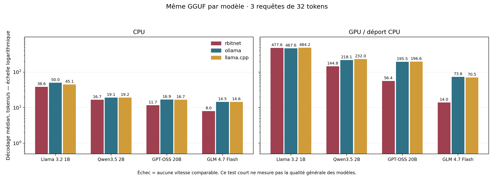

# Deuxième tour : récurrence Qwen résidente et sortie GPU — 3 octobre 2026

Le gain principal de ce tour vient du calcul récurrent de Qwen3.5 sur CUDA. La parité générale avec Ollama et llama.cpp reste à atteindre. Les mesures définitives des quatre modèles, les réponses brutes et les limites de chaque moteur sont conservées dans ce dossier.

Débit de décodage médian en tokens/s. **Avant** désigne le [tour précédent](../2026-10-03-parity/README.md). Les huit mesures Rbitnet finales utilisent la configuration retenue (récurrence Qwen activée, sortie commune expérimentale désactivée). Les 16 références ont été remesurées pendant ce même tour, avant la décision sur la sortie commune.

| Modèle | Rbitnet CPU avant → après | Ollama CPU | llama.cpp CPU | Rbitnet GPU avant → après | Ollama GPU | llama.cpp GPU | Contrôles par moteur |
|---|---:|---:|---:|---:|---:|---:|---:|---:|
| Llama 3.2 1B | 38.8 → **38.6** | 50.0 | 45.1 | 477.6 → **477.6** | 467.6 | 484.2 | 3/3 |
| Qwen3.5 2B | 16.5 → **16.7** | 19.1 | 19.2 | 56.1 → **144.8** | 218.1 | 232.0 | 2/3 |
| GPT-OSS 20B | 12.3 → **11.7** | 16.9 | 16.7 | 58.3 → **56.4** | 195.5 | 196.6 | 3/3 |
| GLM 4.7 Flash | 8.8 → **8.0** | 14.5 | 14.6 | 14.2 → **14.0** | 73.6 | 70.5 | 3/3 |

Qwen GPU passe de **56.1 à 144.8 tok/s**, soit **×2.58**. Sa requête HTTP médiane passe de **1255.1 à 471.8 ms** ; préremplissage de **666.0 à 232.0 ms**. Il reste **33.6 %** sous Ollama et **37.6 %** sous llama.cpp en décodage. La latence HTTP reste aussi supérieure à celle des références.

Llama GPU mesure **477.6 tok/s**, contre **467.6** et **484.2** : **+2.1 %** face à Ollama et **-1.4 %** face à llama.cpp sur ces prompts. Les temps HTTP restent **139.0 / 126.5 / 91.0 ms**. Ce tour ne change pas son calcul de couches ; ces trois prompts courts n’établissent aucun dépassement durable.

Les débits CPU restent proches du tour précédent, avec des valeurs parfois inférieures ; aucun gain CPU n’est revendiqué. GPT-OSS/GLM GPU ne progressent pas dans ce rerun et conservent un écart important avec les références. GLM garde **12 279 Mio de poids CUDA**, comme au tour précédent. La sortie expérimentale a été isolée puis laissée en opt-in à partir des résultats d’ablation ci-dessous.

Chaque moteur/backend passe 11 contrôles sur 12. Qwen répond « OK » au lieu d’ORION sur la fixture de mémoire, comme les références. Les mêmes comptes de tokens de prompts ont été vérifiés pour les 24 configurations, avec trois sorties de 32 tokens chacune.

Données : [24 configurations finales et réponses brutes](results.json), [8 mesures Rbitnet finales](rbitnet-final.json), [rerun initial et 16 références](results-head-enabled.json), [résumé CSV](summary.csv), [tableaux de latence/mémoire](tables.md), [manifeste](manifest.json). Les mesures des dossiers précédents restent figées.

## Ce qui a changé

Les 18 blocs récurrents du Qwen3.5 2B testé conservent leur convolution et leur état GDN F32 sur la carte. Chaque graphe comprend les huit projections, les normalisations, les portes, la récurrence, le FFN et les résidus. Un warp traite une ligne de valeurs de l’état : décroissance, prédiction, mise à jour puis projection de sortie. Une synchronisation hôte reste nécessaire par bloc, et les six blocs d’attention complète conservent leur chemin CPU/GPU.

Cette implémentation suit les équations GGUF du moteur et le regroupement de têtes du [kernel ggml épinglé](https://github.com/ggml-org/llama.cpp/blob/631109b34/ggml/src/ggml-cuda/gated_delta_net.cu). Le [kernel FLA](https://github.com/fla-org/flash-linear-attention/blob/main/fla/ops/gated_delta_rule/fused_recurrent.py) sert de source pour la fusion des opérations et le traitement de l’état. Les normalisations et dispositions de têtes ne sont pas interchangeables : le chemin GGUF conserve `max(sum, epsilon)` pour L2, et aucun état récurrent n’est copié sur CPU à chaque token.

Le chemin CPU met l’état à jour en place, sans cloner toute la matrice. Son état et ses sorties sont identiques bit à bit à l’ancien calcul F32 dans les tests de régression. Cela réduit les copies ; ce tour ne démontre pas un gain de débit CPU.

Une sortie expérimentale partagée Qwen/GPT-OSS/GLM, activée par `RBITNET_CUDA_HEAD=1`, exécute RMSNorm, projection quantifiée et réduction gloutonne sur GPU. Le mode glouton rapatrie un ID de quatre octets ; sampling, pénalités et masques JSON continuent à recevoir les logits F32 et utilisent le sampler Rust. L’argmax conserve les règles de NaN, de zéros signés et d’égalité du sampler. Chaque contexte possède ses buffers et son flux CUDA ; les poids immuables restent vivants par des clones Rust.

Le lancement parallèle des tests matériels a exposé un retour CUDA 35 pendant les premières allocations de runtimes chargés simultanément. Le chargement à froid est désormais sérialisé et termine l’initialisation paresseuse avec `cudaFree(nullptr)` avant de rendre le runtime. Les kernels, graphes et métriques par modèle restent indépendants. Le [guide NVIDIA](https://docs.nvidia.com/cuda/cuda-programming-guide/02-basics/intro-to-cuda-cpp.html#runtime-initialization) décrit cette initialisation différée et le contexte primaire partagé entre threads. Les tests de graphes passent ensemble ; huit chargeurs/uploads simultanés ont aussi été exécutés.

Le flux UTF-8 commun attend les continuations d’un caractère fragmenté. Il est maintenant utilisé par Llama, Qwen, GPT-OSS et GLM.

## Ablation de la sortie GPU commune

Une chauffe exclue puis les trois mêmes histoires de 32 tokens par variante, même binaire. La récurrence Qwen reste activée dans les deux modes. Les échantillons complets sont conservés dans [head-ablation.json](head-ablation.json).

| Modèle GPU | Sortie antérieure (tok/s) | Sortie CUDA (tok/s) | Écart CUDA | Texte identique sur les 3 prompts |
|---|---:|---:|---:|---|
| qwen35-2b | 145.5 | 145.5 | +0.0 % | oui |
| gpt-oss-20b | 57.0 | 54.8 | -3.9 % | oui |
| glm47-flash | 13.9 | 13.0 | -5.9 % | oui |

Ces trois prompts courts ne permettent pas d’estimer précisément un petit écart. Ils ne montrent aucun gain de vitesse, malgré moins de données rapatriées. **La sortie commune reste donc désactivée par défaut** ; le benchmark final utilise ce choix. Le mode glouton déjà résident de Llama reste activé. Aucun résultat d’ablation n’est présenté comme une amélioration de débit.

## Validation

216 tests du workspace réussissent, aucun échec ; un test reste ignoré. Clippy termine avec les avertissements existants. Les nouveaux chemins CUDA ont aussi été exécutés sur la RTX 4080 SUPER, avec les opt-ins matériels : ce sont des validations distinctes du workspace CPU.

- Bloc Qwen : oracle indépendant F64 de l’ensemble du bloc, projections F32/Q8_0/Q4_K, largeurs de tête 32/128, plusieurs têtes et convolutions de 1/4 taps, 34 étapes avec remise à zéro par cas, exécution capturée et eager. Erreur absolue maximale : **5,94 × 10⁻⁷**.
- Sortie GPU : vocabulaire de 131 079 entrées, oracle F64 des logits, entrées modifiées sur les mêmes graphes, NaN et maxima ex æquo répartis entre blocs ; ID comparé au sampler Rust.
- Qwen réel : **53 IDs**, textes et arrêts de quatre séquences retournées directement par llama.cpp, reproduits en CPU, CUDA capturé, récurrence CUDA eager, chemin sans blocs/sortie résidents et ancienne DLL. Plusieurs requêtes sur le même runtime vérifient la remise à zéro des états.
- Llama réel : **43 IDs** de référence, texte et arrêts reproduits en CUDA résident après l’extraction du prédicat glouton et du helper UTF-8 commun.
- Kernels précédents : huit formats quantifiés, vues/batches, concurrence, experts avec biais et SwiGLU standard/OAI, attention GQA/MLA avec sinks/fenêtres et restauration de préfixe passent sur matériel dans la même série.

Les [commandes, environnements, empreintes et résultats](validation.json) renvoient aux [logs conservés](validation-logs/). Les [empreintes des sources](source-hashes.json) identifient les changements locaux au-dessus de `ab520d0`. Les huit mesures Rbitnet finales utilisent le binaire reconstruit après le choix de laisser la sortie GPU commune en opt-in ; les références sont celles du rerun complet de ce même tour. Les sources, les binaires et les jeux de mesures sont identifiés séparément, et leurs empreintes sont vérifiées à la fin.

Avec les templates GGUF normaux, **21 paires HTTP/SSE** ont été vérifiées sur les quatre modèles : glouton, sampling seedé et pénalités ; 12 paires dans la configuration par défaut et neuf avec la sortie GPU expérimentale activée. Toutes les réponses sont non vides, SSE est identique à la réponse complète, `[DONE]` est reçu, et accents/emoji ne contiennent aucun caractère de remplacement. Les [requêtes et réponses exactes](http.json) sont conservées. La sortie optionnelle reste désactivée dans les mesures finales malgré cette validation fonctionnelle.

## Limites et suite

Le bloc récurrent CUDA est réservé à Qwen dense, aux projections prises en charge et entièrement résidentes, aux mêmes largeurs de têtes K/V, avec une largeur au plus 256. Les petits poids alpha/beta comptent contre le budget de poids ; buffers d’activation, KV et états s’ajoutent à ce budget. Position zéro remet les états à zéro ; les positions suivantes doivent être consécutives. Une erreur pendant l’exécution est propagée, sans basculement silencieux d’un état CUDA vers CPU. Les anciennes DLL et les couches non prises en charge gardent le chemin antérieur. Flags d’ablation : `RBITNET_CUDA_QWEN_RECURRENT=0`, `RBITNET_CUDA_QWEN_RECURRENT_GRAPH=0`, `RBITNET_CUDA_HEAD=0`.

Le préremplissage reste token par token. Pour Qwen, le prochain chantier est le graphe des six couches d’attention complète puis la conservation des activations entre couches. Pour GPT-OSS/GLM, routeur, normalisations et attention continuent à croiser la frontière CPU/GPU ; GLM déborde des 16 Go de VRAM et conserve du calcul CPU. Le benchmark ne démontre pas l’efficacité sur Qwen MoE, d’autres exports ou du contexte long.

Protocole : même GGUF/tokenizer et mêmes prompts formatés par modèle, un warm-up exclu, trois histoires de 32 tokens, contrôles plafonnés à 256, probe SSE de 16, température zéro, concurrence un, 16 threads demandés. Toutes les références CPU/GPU de ce dossier sont fraîches. Rbitnet réserve 8192 positions contre 1024 demandées aux références ; KV F32 Rbitnet/llama.cpp et défaut F16 Ollama. Les moteurs délimitent leurs phases différemment ; le timer de phase Rbitnet a une résolution d’une milliseconde. Les trois contrôles de réponse ne constituent pas une évaluation générale de qualité, et trois prompts courts ne justifient pas un p95 ou une extrapolation au contexte long.

Machine : Ryzen 7 9800X3D, 8 cœurs / 16 threads, RTX 4080 SUPER 16 Go, Windows, CUDA 13.3. llama.cpp b11351 (`631109b34`), Ollama 0.35 ; déport et mémoire réellement observés dans les données. Ollama a tourné sur un daemon de benchmark séparé, sans modifier le daemon utilisateur.

Reproduction : reconstruire le binaire avec `cargo build --release -p rbitnet-cli --bin rbitnet` et la DLL avec `scripts/build_cuda_quant.ps1`, adapter les chemins du [manifeste](manifest.json), puis lancer `scripts/benchmark_engines.py --manifest … --output … --engines rbitnet ollama llama.cpp --backends cpu gpu --repeats 3 --tokens 32`. Pour les séquences Qwen, les chemins GGUF/tokenizer/fixture sont fournis par `RBITNET_QWEN_TEST_GGUF`, `RBITNET_QWEN_TEST_TOKENIZER`, `RBITNET_QWEN_SEQUENCE_JSON`; `RBITNET_QWEN_REQUIRE_RESIDENT=1` exige l’activation des blocs pour le test CUDA. La [fixture de 53 IDs](../../../tests/data/golden/qwen35-2b-q8_0.sequence.json) conserve les empreintes du modèle et du tokenizer.
