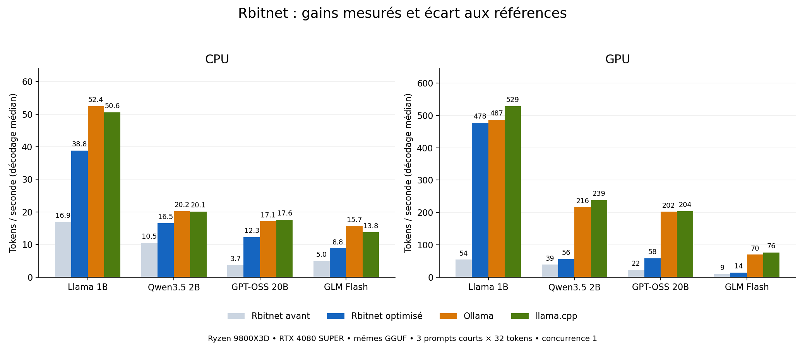

# Optimisation native et recherche de parité — 3 octobre 2026

**Le moteur progresse sur les quatre modèles, mais la parité générale avec Ollama et llama.cpp n'est pas atteinte.** Llama approche les références GPU sur les prompts courts. Les autres architectures conservent des transferts d'activations et du calcul CPU. Les poids, les réponses brutes et les limites du protocole restent visibles dans les résultats.

Débit de décodage médian, en tokens/s ; **avant** désigne le moteur livré au commit `817850a` dans le [dossier précédent](../2026-10-03-optimized/README.md). Les références ont été remesurées après les optimisations, avec les mêmes GGUF et prompts.

| Modèle | Rbitnet CPU avant → après | Ollama CPU | llama.cpp CPU | Rbitnet GPU avant → après | Ollama GPU | llama.cpp GPU | Contrôles par moteur |
|---|---:|---:|---:|---:|---:|---:|---:|
| Llama 3.2 1B | 16.9 → **38.8** | 52.4 | 50.6 | 54.0 → **477.6** | 487.0 | 528.6 | 3/3 |
| Qwen3.5 2B | 10.5 → **16.5** | 20.2 | 20.1 | 38.5 → **56.1** | 216.5 | 238.7 | 2/3 |
| GPT-OSS 20B | 3.7 → **12.3** | 17.1 | 17.6 | 22.1 → **58.3** | 202.0 | 204.0 | 3/3 |
| GLM 4.7 Flash | 5.0 → **8.8** | 15.7 | 13.8 | 9.1 → **14.2** | 69.7 | 76.5 | 3/3 |

Sur Llama GPU, Rbitnet atteint **477,6 tok/s**, contre **487,0** pour Ollama et **528,6** pour llama.cpp : écarts de **1,9 %** et **9,6 %** sur ces trois prompts. Les temps HTTP médians sont respectivement **142,6 ms**, **141,0 ms** et **79,5 ms**. Le décodage approche Ollama, mais le préremplissage reste plus lent que llama.cpp.

Les gains CPU sont de **×2,30 / ×1,57 / ×3,31 / ×1,77** dans l’ordre du tableau ; GPU **×8,85 / ×1,46 / ×2,64 / ×1,57**. Les contrôles passent 11 fois sur 12 pour chaque moteur et chaque backend. Le débit de Qwen, GPT-OSS et GLM reste sous celui des références.

Données : [24 configurations et réponses brutes](comparison.json), [8 configurations Rbitnet](results.json), [16 références fraîches](reference-refresh.json), [temps, débit et mémoire en CSV](summary.csv), [validation détaillée](validation.json).

## Changements exécutés

- CPU : décodage direct des poids empaquetés dans les registres AVX2/FMA/F16C, ou AVX512F/BW quand disponibles ; huit formats, activations conservées en F32, repli sur le décodeur existant. Le pool quantifié respecte désormais `RAYON_NUM_THREADS`.
- Placement Llama : le budget automatique compte les octets quantifiés effectivement chargés. L'ancienne estimation F32 ne plaçait que 13 des 16 couches du modèle 1B sur GPU. La sélection explicite de couches reste prioritaire.
- CUDA : kernels spécialisés par format, lecture par groupes de quatre poids pour K/Q8/MXFP4 et réutilisation des échelles. Un essai à 512 threads par bloc a régressé sur Llama ; 256 threads sont conservés.
- Llama CUDA entièrement déporté : activations et KV sur la carte, RMSNorm/résidu et RoPE/écriture KV fusionnés, vrais `cudaStreamBeginCapture` / `cudaGraphInstantiate` / `cudaGraphLaunch`. Une position en mémoire GPU évite de recapturer à chaque token. Le mode glouton ne rapatrie que l'ID choisi ; le mode général rapatrie les logits pour le sampler Rust habituel. Le cache CPU inutilisé n'est plus effacé à chaque requête.
- GPT-OSS/GLM : les experts sélectionnés d'une couche entièrement déportée partagent un graphe CUDA. Projections, biais, SwiGLU standard/OAI et somme pondérée restent sur la carte, avec une synchronisation hôte par FFN. La sélection du routeur reste sur CPU. Les couches partiellement déportées gardent le chemin précédent.
- Les compteurs de replay ne comptent plus l'ancien échafaudage de planification comme une exécution CUDA. Les flux Llama attendent la fin d'un caractère UTF-8 fragmenté avant de l'émettre.

Le profilage intermédiaire de Llama passe d'environ 19 à 26 tok/s CPU avec AVX2, et de 54 à 90 GPU avec les kernels spécialisés et le placement corrigé. Le benchmark HTTP intermédiaire donne 194 GPU avec le graphe résident, 395 après déroulage des blocs quantifiés, puis environ 478 après les lectures empaquetées et fusions. Ces essais ont des frontières de mesure différentes : ils ne forment pas une décomposition additive des gains.

## Recherches et suites utiles

Les priorités ci-dessous combinent des sources primaires et les défauts observés dans Rbitnet ; les gains futurs restent à mesurer.

| Méthode | Source primaire et application à Rbitnet | État |
|---|---|---|
| Graphe CUDA réutilisable | [NVIDIA : optimisation de llama.cpp](https://developer.nvidia.com/blog/optimizing-llama-cpp-ai-inference-with-cuda-graphs/) explique la réduction des intervalles entre lancements. Les positions variables doivent rester des données du graphe. | Implémenté pour Llama dense et FFN routés ; aucun facteur publié par NVIDIA n'est utilisé comme prévision locale. |
| Produit scalaire quantifié SIMD | [Kernels CPU ggml](https://github.com/ggml-org/llama.cpp/blob/631109b34/ggml/src/ggml-cpu/quants.c) et [kernels CUDA MMVQ](https://github.com/ggml-org/llama.cpp/blob/631109b34/ggml/src/ggml-cuda/mmvq.cu) : traitement empaqueté et coopération des lanes. | SIMD F32/poids empaquetés et kernels CUDA natifs implémentés. Quantifier une fois les activations en Q8, puis utiliser les produits entiers VNNI/DP4A, reste une piste CPU/GPU avec validation numérique préalable. |
| GDN fusionné sur GPU | [Implémentation FLA du Gated Delta Rule](https://github.com/fla-org/flash-linear-attention/blob/main/fla/ops/gated_delta_rule/fused_recurrent.py) ; Qwen nécessite sa récurrence, sa convolution et ses normalisations propres. | Récurrence encore sur CPU. Le prochain gros chantier Qwen est un état GDN résident puis un graphe complet ; copier tout l'état à chaque token annulerait une partie du gain. |
| Préremplissage par matrices et attention par tuiles | [FlashAttention](https://arxiv.org/abs/2205.14135) réduit les échanges mémoire d'une attention exacte. | Préremplissage encore token par token ; priorité GEMM par blocs, puis attention adaptée au contexte long. Le gain en attention courte ne doit pas être extrapolé. |
| Décodage spéculatif | [Leviathan et al.](https://arxiv.org/abs/2211.17192) : proposer plusieurs tokens avec un petit modèle, les vérifier ensemble, appliquer l'acceptation/correction pour conserver la distribution cible. | Piste pour dépasser le décodage unitaire. Nécessite un vrai draft, une vérification matricielle par lots, le retour arrière du KV et un taux d'acceptation mesuré. Les hooks existants ne prouvent pas ce gain. |
| Batching et partage du KV | [PagedAttention](https://arxiv.org/abs/2309.06180) porte sur la mémoire et le débit du service avec plusieurs requêtes. | Autre scénario à mesurer, après intégration des graphes aux caches paginés. Un débit agrégé ne remplace pas la comparaison mono-requête de ce dossier. |

Pour dépasser durablement les références, le candidat prioritaire est la vérification spéculative par lots **après** suppression des calculs intermédiaires CPU. Les poids MTP éventuels demandent une exécution et une validation propres ; leur présence dans un export n'assure ni leur utilisation ni un gain. Il faut mesurer les tokens acceptés par vérification, le coût du draft, le KV supplémentaire, la latence complète et la qualité. Aucun dépassement général n'est démontré ici.

## Validation et périmètre

211 tests du workspace réussis, aucun échec ; un test déjà ignoré. Quatre tests Python du protocole passent. Clippy termine avec les avertissements existants ; les nouveaux modules sont formatés, tandis que le contrôle de format global relève encore des différences préexistantes hors périmètre.

Les tests matériels opt-in ont réellement tourné sur la RTX 4080 SUPER : huit formats quantifiés et vues de lignes/batches/concurrence, huit formats d'experts avec biais et SwiGLU standard/OAI comparés à un oracle F64 indépendant, puis changements d'experts sur le même graphe. Les chemins SIMD AVX2 et AVX512 sont également comparés au décodage F64 indépendant.

Les cinq cas Llama figés reproduisent les **43 IDs** de la référence, le texte et l'arrêt BOS/EOS en CPU, CUDA résident capturé, résident sans graphe et fallback. L'oracle d'attention autonome couvre GQA/MLA, sinks/fenêtres et positions jusqu'à 2047 ; la validation du graphe Llama complet porte ici sur les séquences courtes figées.

Le binaire et la DLL finaux sont reconstruits. Trois appels HTTP avec le template GGUF normal — greedy, sampling avec seed et pénalités — renvoient des réponses non vides avec accents/emoji ; SSE et réponse complète sont identiques et `[DONE]` est reçu. Les [réponses exactes](http-resident.json) et les [empreintes des binaires](validation.json) sont conservées. Le binaire chronométré précède les derniers ajustements de format, de placement explicitement demandé et de flux UTF-8 ; les empreintes distinguent mesure et validation finale.

Llama résident exige CUDA, toutes les projections quantifiées sur la carte, KV dense, absence de restauration de préfixe et absence de normalisation Q/K par tête. Une ancienne DLL, un déport partiel ou une autre disposition utilisent le chemin existant. Le graphe reçoit un token à la fois ; son KV reste F32 et limité à 8192 positions. Le greedy GPU est réservé à la température nulle, sans pénalités ni contraintes JSON ; les autres modes utilisent les logits et le sampler commun.

GLM dépasse les 16 Go de VRAM : environ 12 Go de poids sont déportés, et des experts restent sur CPU. Qwen GDN, les projections/sampling hors Llama et l'attention MLA conservent des frontières CPU/GPU. Les trois contrôles de réponse ne constituent pas une évaluation générale de qualité. Qwen garde le même échec de rappel ORION que les références sur cette fixture.

Même machine que les dossiers précédents : Ryzen 7 9800X3D, 8 cœurs / 16 threads, RTX 4080 SUPER 16 Go, CUDA 13.3, Windows. Même GGUF et tokenizer par modèle, température 0, concurrence 1, chauffe exclue, trois histoires de 32 tokens, contrôles plafonnés à 256, probe SSE de 16. Les prompts déjà formatés et leurs IDs sont conservés. Rbitnet réserve 8192 positions contre 1024 demandées aux références ; KV F32 pour Rbitnet/llama.cpp, défaut F16 pour Ollama. Les phases ont des frontières différentes et le chronomètre Rbitnet a une résolution d'une milliseconde : lire aussi les temps HTTP et les échantillons.

Commandes de reproduction : `scripts/benchmark_engines.py` avec le manifeste local et la DLL reconstruite par `scripts/build_cuda_quant.ps1`. Le [protocole](../2026-10-03/README.md) explique les modèles et le format du manifeste. Les octets des binaires mesurés et les empreintes des modèles sont enregistrés dans les JSON ; les profils intermédiaires ne servent pas de référence comparative finale.
