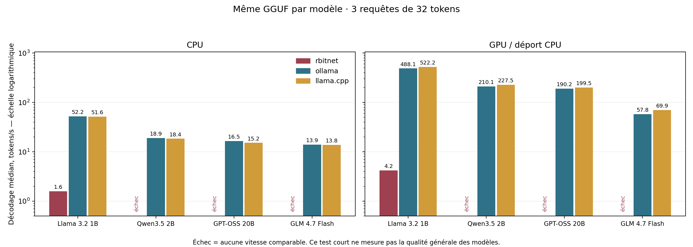

# Comparatif réel Rbitnet / Ollama / llama.cpp — 3 octobre 2026

Sur les quatre GGUF testés, **Rbitnet exécute Llama 3.2 1B en CPU et en CUDA, mais échoue sur Qwen3.5, GPT-OSS et GLM**. Ollama et llama.cpp exécutent les quatre modèles dans les deux scénarios. Sur Llama, les réponses de contrôle sont correctes avec Rbitnet, mais son décodage reste environ 32 fois plus lent en CPU et 116 à 125 fois plus lent dans le scénario CUDA de ce test court.

24 configurations ont été tentées : 18 fonctionnent, 6 échouent. Les échecs n'ont aucune vitesse attribuée. Les résultats sont des observations sur cette machine et ces exports, pas une certification générale des moteurs ou des modèles.

## Résultats principaux

Débit médian de la phase de décodage, en **tokens/s CPU / GPU**, sur trois requêtes plafonnées à 32 tokens chacune :

| Modèle | Rbitnet | Ollama | llama.cpp |
|---|---:|---:|---:|
| Llama 3.2 1B | 1,6 / 4,2 | 52,2 / 488,1 | 51,6 / 522,2 |
| Qwen3.5 2B | échec / échec | 18,9 / 210,1 | 18,4 / 227,5 |
| GPT-OSS 20B | échec / échec | 16,5 / 190,2 | 15,2 / 199,5 |
| GLM 4.7 Flash, MoE | échec / échec | 13,9 / 57,8 | 13,8 / 69,9 |

**GLM utilise GPU + CPU** : son GGUF de 17,05 Gio dépasse la capacité de la carte. Les politiques de déport des deux moteurs diffèrent. Rbitnet CUDA utilise aussi des opérations CPU ; ses compteurs enregistrent 214 016 appels GEMV GPU à la fin de la ligne Llama, contre zéro pour la ligne CPU. Les autres exécutions llama.cpp CUDA allouent effectivement de la VRAM, mais les journaux de cette version au niveau de verbosité choisi ne détaillent pas leur placement couche par couche.

Les [tableaux complets](tables.md) donnent également la latence HTTP, la RAM et le delta de VRAM. La [synthèse CSV](summary.csv) fournit les médianes, minimums et maximums des trois mesures, le préremplissage et le premier fragment reçu en streaming. Le [JSON complet](results.json) conserve les réponses, les compteurs, les paramètres et les erreurs. Aucun percentile p95 n'est déduit de trois échantillons.

## Réponses réellement obtenues

Trois vérifications déterministes ont été exécutées après chaque ligne fonctionnelle : capitale de la France, `7 × 8`, puis rappel de `ORION` dans une conversation à plusieurs tours. Le score exige la réponse demandée, avec tolérance pour ponctuation et casse.

| Modèle | Résultats observés |
|---|---|
| Llama 3.2 1B | 3/3 dans les six configurations ; notamment `Paris.`, `56`, `ORION.` avec Rbitnet CPU et CUDA |
| Qwen3.5 2B | 2/3 avec Ollama et llama.cpp, en CPU et GPU ; le rappel renvoie `OK` au lieu de `ORION` |
| GPT-OSS 20B | 3/3 avec Ollama et llama.cpp, en CPU et GPU ; la réponse finale est extraite du format Harmony |
| GLM 4.7 Flash | 3/3 avec Ollama et llama.cpp, en CPU et GPU |

Qwen produit également un début d'histoire lisible dans les requêtes de débit. Son échec au rappel est observé avec les deux moteurs sur le même prompt et ne suffit pas à diagnostiquer un défaut du moteur. Ces trois questions vérifient un fonctionnement élémentaire ; elles ne mesurent ni la qualité générale, ni le français, ni le code, ni les outils, ni le raisonnement difficile. Le raisonnement de GPT-OSS compte dans les tokens et son premier fragment streaming peut être un marqueur ou du raisonnement, avant la réponse finale.

La [validation antérieure de la correction Llama](../../validation/2026-10-03-llama32-inference-fix.json) couvre séparément cinq conversations et 43 IDs de tokens comparés au moteur de référence.

## Échecs Rbitnet

| Fichier testé | CPU | CUDA |
|---|---|---|
| Qwen3.5, `qwen35` | HTTP 400 : `missing llama.embedding_length` | même erreur |
| GPT-OSS, `gpt-oss` | HTTP 400 : `missing llama.embedding_length` | même erreur |
| GLM Flash, `deepseek2` | `/ready` 503 : backend CUDA exigé | `/ready` 503 : graphes MLA/MoE non implémentés, tenseurs refusés par le chemin Llama |

Le dispatch actuel retombe sur Llama pour `qwen35` dense et pour le nom canonique `gpt-oss`. Le [contrôle supplémentaire de l'alias GPT](gpt-alias-diagnostic.json) force `RBITNET_ARCHITECTURE=gptoss` : le CPU est refusé et CUDA refuse encore la topologie réelle. Le problème GPT ne se résout donc pas uniquement en changeant le nom d'architecture. Pour ces six lignes, aucune génération de remplacement ou de stub n'est comptée.

Ces observations donnent deux travaux distincts : implémenter les topologies réelles des modèles absents, puis profiler et accélérer Llama. Le benchmark confirme la cohérence élémentaire de Llama après correction, sans confirmer la compétitivité de Rbitnet.

## Machine, versions et poids

- Windows, AMD Ryzen 7 9800X3D, 8 cœurs / 16 processeurs logiques, 61,61 Gio de RAM physique.
- NVIDIA RTX 4080 SUPER, 16 376 Mio de VRAM, pilote 610.88. Applications de bureau présentes ; aucun autre modèle Ollama chargé pendant les mesures.
- Rbitnet : code d'inférence au commit `7eca9ad`, binaire release ; bibliothèque CUDA native compilée avec CUDA Toolkit 13.3 / MSVC. Les empreintes des binaires figurent dans `results.json`.
- Ollama `0.35.0`. Llama utilise le daemon existant, initialement vide ; les trois autres modèles utilisent un daemon dédié, avec une requête parallèle et un modèle chargé au maximum. Le daemon dédié est arrêté après le test.
- llama.cpp : release [b11351](https://github.com/ggml-org/llama.cpp/releases/tag/b11351), commit `631109b34`, binaires officiels Windows CPU et CUDA 12.4.

| Modèle commercial | Paramètres présents dans les tenseurs GGUF | Taille GGUF | Quantification de l'export | Source figée |
|---|---:|---:|---|---|
| Llama 3.2 1B Instruct | 1 235 814 432 | 0,75 Gio | Q4_K_M | [Unsloth, b69aef1](https://huggingface.co/unsloth/Llama-3.2-1B-Instruct-GGUF/tree/b69aef112e9f895e6f98d7ae0949f72ff09aa401) |
| Qwen3.5 2B, texte | 1 881 825 088 | 1,87 Gio | Q8_0 | [Unsloth, f6d5376](https://huggingface.co/unsloth/Qwen3.5-2B-GGUF/tree/f6d5376be1edb4d416d56da11e5397a961aca8ae) |
| GPT-OSS 20B, MoE | 20 914 757 184 | 10,83 Gio | export Q4_K_M, avec 72 tenseurs d'experts MXFP4 | [Unsloth, d449b42](https://huggingface.co/unsloth/gpt-oss-20b-GGUF/tree/d449b42d93e1c2c7bda5312f5c25c8fb91dfa9b4) |
| GLM 4.7 Flash, MoE | 29 943 393 920 | 17,05 Gio | Q4_K_M, formats mixtes | [Unsloth, 0d32489](https://huggingface.co/unsloth/GLM-4.7-Flash-GGUF/tree/0d32489ecb9db6d2a4fc93bd27ef01519f95474d) |

Les SHA-256 complets, révisions des tokenizers et types de tenseurs sont enregistrés dans le JSON. Les trois empreintes téléchargées ont été comparées aux empreintes LFS des révisions figées. Llama conserve l'empreinte déjà validée lors de la correction. Chaque moteur utilise les mêmes octets GGUF pour un modèle donné ; les quantifications diffèrent entre modèles. GPT-OSS possède 32 experts / 4 sélectionnés et GLM 64 / 4, selon les métadonnées de ces fichiers. L'inférence est textuelle ; aucun projecteur d'image n'est utilisé.

Les blobs Qwen, GPT-OSS et GLM initialement installés dans Ollama échouaient au préchargement llama.cpp : sections RoPE de longueur 3 au lieu de 4 pour Qwen, noms `gptoss` et `glm4moelite` non reconnus pour les deux autres. Le [précontrôle](vendor-gguf-preflight.json) conserve ces erreurs. Les exports communs ont ensuite été importés sous des alias de benchmark, sans modifier les modèles habituels ni transformer leurs tenseurs.

## Protocole et limites de comparaison

1. Moteurs lancés successivement, concurrence 1, budget CPU de 16 processeurs logiques ; génération gloutonne, température 0, pénalités désactivées. Seed 0 explicite pour Ollama et llama.cpp ; aucun seed explicite pour Rbitnet, dont le choix glouton ne dépend pas du générateur aléatoire.
2. Une chauffe exclue des médianes, puis trois prompts d'histoire distincts, chacun produisant exactement 32 tokens. Les comptes de prompt correspondent aux fixtures pour les 54 échantillons de débit et les 54 réponses de contrôle.
3. llama.cpp reçoit les IDs préparés par son tokenizer ; Ollama reçoit la chaîne correspondante avec `raw=true`. Rbitnet utilise `{user}` pour transmettre cette chaîne sans ajouter une deuxième conversation. Les [fixtures Llama](llama32-1b-prompts.json), [Qwen](qwen35-2b-prompts.json), [GPT](gpt-oss-20b-prompts.json) et [GLM](glm47-flash-prompts.json) conservent les prompts et IDs, y compris la date dans le template GPT. Une égalité de comptes seule ne prouve pas tous les IDs ; la validation Llama citée plus haut fournit ce contrôle supplémentaire.
4. Cache de préfixe désactivé dans Rbitnet et llama.cpp. Ollama est déchargé et préchargé sans prompt avant chaque mesure, probe streaming et question. La durée de chargement est exclue du chronomètre principal ; la durée résiduelle signalée par l'API est conservée.
5. Débit calculé avec les tokens et durées de décodage rapportés par les moteurs. Ces frontières de phase peuvent différer ; la latence HTTP et le débit sur temps total sont également conservés. Le probe streaming mesure un premier fragment non vide sur une seule requête de 16 tokens, sans prétendre mesurer la latence de réponse finale.
6. llama.cpp et Ollama demandent un contexte de 1 024 tokens. Rbitnet Llama réserve sa capacité interne de 8 192 positions. Son KV est F32, comme le KV explicitement demandé à llama.cpp ; Ollama conserve son défaut F16. La RAM ne correspond donc pas à une allocation KV identique. Les prompts sont courts et restent sous toutes ces limites.
7. Le scénario GPU utilise le chemin CUDA de Rbitnet et l'ajustement mémoire des autres moteurs : `-ngl auto` pour les nouveaux exports llama.cpp, `-ngl 99` pour Llama entièrement logeable. Le déport GLM est attesté par les overrides CPU du journal llama.cpp et par la résidence VRAM partielle de l'API Ollama, environ 13,68 Gio sur une allocation modèle de 17,31 Gio. Aucun placement identique des experts ou couches n'est imposé.
8. RAM : maximum échantillonné de la somme des working sets du processus et de ses enfants, chargement compris ; des pages partagées peuvent être comptées plusieurs fois. VRAM : delta du total NVIDIA par rapport au début de chaque ligne, échantillonné environ toutes les 0,75 s. Il inclut les fluctuations du bureau, peut manquer un pic bref, et n'est pas une attribution par processus. Le budget disponible varie entre lignes ; cela affecte aussi le déport automatique de GLM.

Pour reproduire la mesure, utiliser le [mode d'emploi](../../BENCHMARKS.md#reproduce-the-comparison), le [manifest exemple](../../../scripts/engine_benchmark_manifest.example.json) et `scripts/benchmark_engines.py`. Copier également les fixtures de ce dossier vers le répertoire de sortie pour conserver exactement les prompts. `scripts/render_engine_benchmark.py` régénère tables, CSV et graphique à partir du JSON. Les chemins locaux du résultat publié sont remplacés par des placeholders ; les fichiers complets et journaux d'origine restent dans `target/engine-benchmark/` sur la machine du test.

Validation du dossier : 24 lignes uniques, 18 lignes fonctionnelles, 6 erreurs explicites, 54 mesures de débit de 32 tokens, prompts alignés et streaming reçu sur les 18 lignes fonctionnelles. Les trois tests Python de comptage/conversion, scoring et protection du daemon passent. Le graphique a été inspecté visuellement. Aucun code d'inférence Rust n'a été modifié pour produire ce benchmark.
