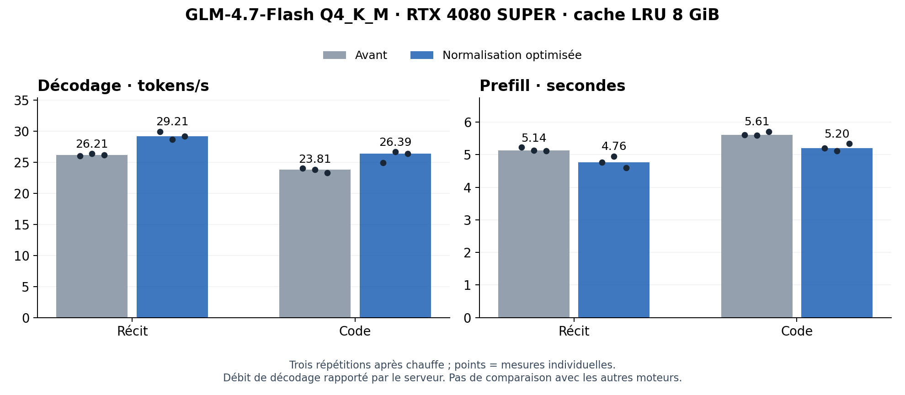

# GLM : normalisation CUDA ordonnée, 4 octobre 2026

Le bloc MLA utilise désormais le noyau de normalisation optimisé déjà validé pour GPT-OSS. Les chargements, ajouts du résidu et carrés indépendants sont parallélisés ; leur somme reste séquentielle, dans le même ordre F32 avec arrondi RN. Les largeurs supérieures à 8 192 conservent l’ancien chemin. Aucun changement de routeur, poids, quantification, cache KV ou politique d’éviction n’est inclus.

## Mesures sur le vrai modèle

GLM-4.7-Flash Q4_K_M, RTX 4080 SUPER 16 GiB, cache d’experts LRU 8 GiB, plafond CUDA commun 12 GiB, contexte maximal 2 048. Prompts avec quatre notes communes, température zéro, maximum 128 tokens ; préfixes, transferts asynchrones et préchargement désactivés. Un cycle froid est exclu, suivi de trois cycles mesurés. Les deux bibliothèques sont exécutées successivement avec le même CLI et les mêmes requêtes.

| Prompt | Avant, tokens/s | Optimisé, tokens/s | Gain médian du décodage | Prefill médian |
| --- | ---: | ---: | ---: | --- |
| Récit | 26.21 | 29.21 | +11.5 % | 5136 → 4762 ms (-7.3 %) |
| Code | 23.81 | 26.39 | +10.8 % | 5610 → 5203 ms (-7.3 %) |

Le débit est calculé comme `completion_tokens / (decode_ms / 1000)` avec les métriques du serveur ; il exclut le prefill. Le graphique montre les trois valeurs individuelles et leurs médianes. Les données brutes contiennent aussi la latence HTTP complète, les compteurs CUDA et les mesures de mémoire. Cette série courte n’est pas randomisée et ne démontre pas une significativité statistique ou une parité avec Ollama/llama.cpp.

## Correction et portée

Les 24 réponses HTTP de LRU avant/après ont les mêmes requêtes, choix, textes, nombres de tokens et raisons de terminaison. Chaque cycle reproduit la première réponse froide de son prompt. Douze requêtes supplémentaires en Least-Stale avec le noyau optimisé reproduisent aussi exactement LRU avant optimisation. Aucun repli FFN individuel n’est observé dans ces 36 requêtes ; les compteurs attestent l’utilisation du bloc MLA GPU.

Cinq scénarios réseau supplémentaires passent avec le cache de préfixes activé : annulation du flux puis reprise identique en greedy, sampling avec seed et pénalités ; stop explicite HTTP/SSE avec `[DONE]` ; quatre requêtes simultanées dont les réponses correspondent aux références séquentielles. Le runtime les sérialise : aucune implémentation de continuous batching GLM n’est revendiquée. Ces contrôles de correction avec préfixes sont distincts des mesures de vitesse sans préfixes.

Le noyau de normalisation passe 108 cas de comparaison bit à bit avec l’ancien noyau, oracle F64 indépendant et contrôle des allocations temporaires. Le bloc MLA complet synthétique passe son oracle F64 sur huit formats : experts fixes/dynamiques, modes eager/graphes, repli CPU, reset et restauration de préfixe. Ce même bloc passe Compute Sanitizer synccheck sans erreur avec la nouvelle bibliothèque.

L’ancienne divergence Least-Stale reste inexpliquée. Ces répétitions réussies ne résolvent pas [#85](https://github.com/azerothl/Rbitnet/issues/85) ; la [capture négative et les diagnostics complémentaires](../2026-10-04-glm-cache-diagnostics/README.md) restent conservés. Le défaut de politique reste LRU.

## Versions et reproduction

La nouvelle bibliothèque Native est compilée depuis `a67a1458fae274a266d358ece31334a465ef1334`. Un seul fichier Native change : `native/cuda_quant/src/mla_full.cuh`. Le CLI réutilisé est compilé depuis `084122f1c9195a46ea7e48db8d0247c679bb9ae5` ; toutes les sources Rust et tous les autres fichiers liés à cette compilation sont vérifiés égaux après normalisation des fins de ligne. Le binaire de test réutilisé vient de `0da733e41f4ab32ab6abf569e7c37c632d501fbe`. Aucun nouveau build Rust ni nouvelle validation CPU globale n’est revendiqué. Les empreintes exactes et commandes sont conservées dans `raw/manifest.json.gz`.

La bibliothèque se reconstruit avec `scripts/build_cuda_quant.ps1 -OutDir <sortie>`. Le corpus exact de requêtes et les environnements figurent dans les captures `raw/baseline-results.json.gz`, `raw/staged-results.json.gz` et `raw/least-stale-results.json.gz`. Les helpers sont conservés tels qu’exécutés ; leurs chemins absolus sont à adapter pour une autre installation. Les GGUF/tokenizers sont ceux de `docs/benchmarks/2026-10-03-parity-round2/manifest.json` ; aucun nouveau hash intégral du GGUF n’est revendiqué.

`publication.json` contient les empreintes des artifacts publiés et des octets originaux compressés. `source-index.json` lie les sources Rust/Native et manifestes figés aux blobs Git. Le graphique est reproductible avec `helpers/plot_glm_norm.py --summary raw/summary.json.gz --output performance`.

Périmètre : GPU NVIDIA et GLM. Les résultats ne valident pas AMD, Intel, Metal ou les critères restants de [#95](https://github.com/azerothl/Rbitnet/issues/95). Le prefill GLM reste token par token : cette optimisation ne constitue pas un prefill par blocs ni une GEMM CPU.
