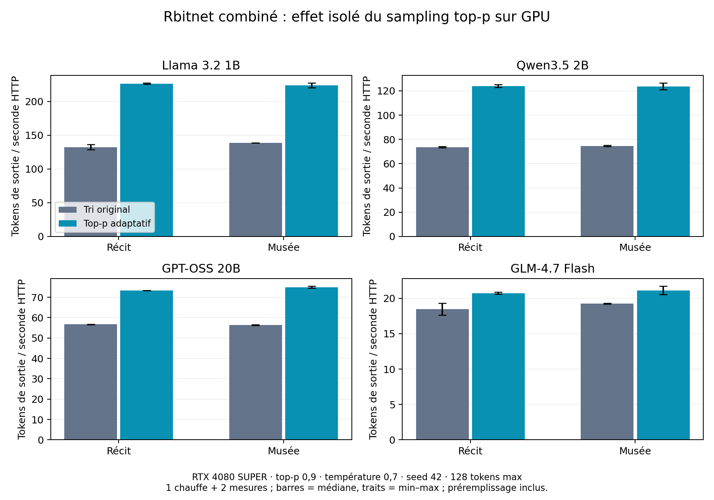

# Exact nucleus sampling on the merged cache stack

Fresh validation binds the combined checkout at `084122f1c9195a46ea7e48db8d0247c679bb9ae5`, after merging
main `ba2cd2fc42448794452f057c02a6c0af22e942d8`. The only compiled differences
from that main are the four reviewed sampling files from #131. Defaults remain
unchanged: activate with `RBITNET_CPU_TOP_P_HEAP=1`.

348 workspace tests passed, one ignored; check and Clippy passed.
2,028 synthetic cases and 864 comparisons on 24 actual frozen GPT-OSS vectors
preserve selected tokens and RNG state. The fresh release CLI produced 96
JSON/SSE/zero-budget records across four models and CPU/CUDA, with identical
outputs, usage and finish reasons between original and adaptive samplers.

The Native DLL is reused from the sealed integration proof, not rebuilt here.
Every Native source path matches that compiled source after CRLF normalization;
the DLL SHA-256 is verified. `raw/native-reuse.json.gz` records this boundary.

## Fresh GPU HTTP throughput

| Model | Prompt | Original tokens/s | Adaptive tokens/s | Change |
|---|---:|---:|---:|---:|
| Llama 3.2 1B | 1 | 132.47 | 226.37 | +70.9 % |
| Llama 3.2 1B | 2 | 138.70 | 223.81 | +61.4 % |
| Qwen3.5 2B | 1 | 73.60 | 124.06 | +68.6 % |
| Qwen3.5 2B | 2 | 74.65 | 123.69 | +65.7 % |
| GPT-OSS 20B | 1 | 56.69 | 73.30 | +29.3 % |
| GPT-OSS 20B | 2 | 56.41 | 74.94 | +32.9 % |
| GLM-4.7 Flash | 1 | 18.49 | 20.73 | +12.1 % |
| GLM-4.7 Flash | 2 | 19.27 | 21.11 | +9.5 % |

These are median output-token / HTTP-wall-time rates, including prefill. One
warmup and two measured samples per cell; original then adaptive order, without
randomization or statistical-significance claim. The two prompts are a story
and a description of a future museum. Same-model sampled outputs match exactly between variants.
This is neither decode-only throughput nor a new comparison with other engines.
Broad nuclei can still incur sorting-fallback overhead; no default promotion.

## Evidence and reproduction

`receipt.json` indexes deterministic gzip captures and exact executed helpers;
`raw/manifest.json.gz` binds compiled sources and artifact identities.
Run the archived checker from a repository checkout with local model paths
adapted. It uses `top-p-actual-inputs.json` for the frozen input identities;
the local float archives, models, DLL and executable are omitted.
Previous standalone measurements remain in the adjacent
`2026-10-04-adaptive-nucleus-fresh` report; these new captures do not replace them.
`sampling-http.csv`, the PNG and PDF expose the current combined measurements.
