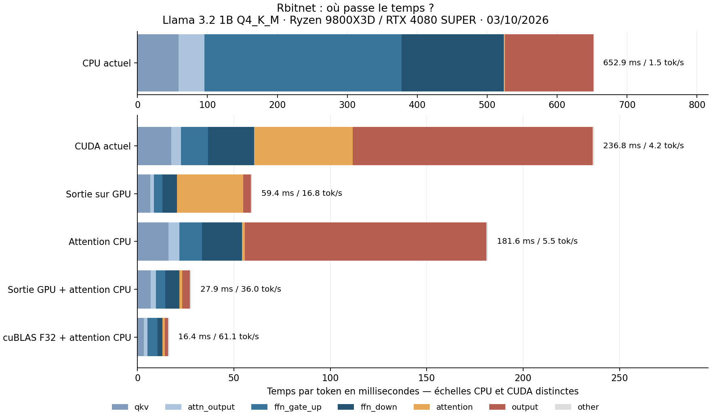

# Diagnostic des résultats Rbitnet du 3 octobre 2026

Le [benchmark](../../benchmarks/2026-10-03/README.md) montre deux problèmes : Llama fonctionne mais son exécution est très lente ; les trois autres architectures ne génèrent pas. Le profilage local mesure les causes sur le même Llama 3.2 1B Q4_K_M. Six variantes atteignent jusqu'à **61,1 tok/s CUDA**, contre **4,2** avec les choix actuels, en produisant les mêmes 16 tokens. Les variantes sont des diagnostics, pas des optimisations livrées du serveur.

## Mesures sur le vrai modèle

Windows, Ryzen 7 9800X3D, 8 cœurs / 16 threads, RAM 61,61 Gio, RTX 4080 SUPER 16 Gio, pilote 610.88, Rust 1.94.1. Base `27828be` avec instrumentation optionnelle `profile-llama`, incluant la correction numérique `7eca9ad`. [results.json](results.json) conserve les empreintes du modèle, tokenizer, DLL CUDA et des deux binaires de profilage ; [summary.csv](summary.csv) contient les agrégats.

Protocole : prompt `throughput-1` du benchmark, **36 tokens de prompt, 16 tokens générés**, greedy, deux répétitions par variante, trois tokens d'échauffement exclus. Forward réel appelé directement ; HTTP, tokenisation, sampling, chargement et remise à zéro du KV exclus. KV dense F32, capacité 8192 comme Rbitnet dans le benchmark. Le dernier forward inutilisé est conservé pour correspondre à la boucle de génération actuelle.

| Variante | Décodage médian, tok/s | Temps par token | Préremplissage médian |
|---|---:|---:|---:|
| CPU actuel, mmap Q4/Q6 | 1,53 | 652,9 ms | 22 561 ms |
| CUDA actuel | 4,23 | 236,8 ms | 7 064 ms |
| CUDA, sortie GPU | 16,83 | 59,4 ms | 1 909 ms |
| CUDA, attention CPU | 5,51 | 181,6 ms | 5 978 ms |
| CUDA, sortie GPU + attention CPU | 36,01 | 27,9 ms | 967 ms |
| CUDA cuBLAS F32, sortie GPU + attention CPU | 61,09 | 16,4 ms | 605 ms |

Les **12 générations ont exactement les mêmes 16 IDs**. Leur texte correspond au début de la réponse llama.cpp du benchmark. Les comptes d'opérations sont vérifiés pour chaque phase. Cela valide ce cas court, sans certifier toutes les réponses ou la stabilité numérique générale. Deux répétitions ne suffisent pas pour des percentiles ou une conclusion long contexte. Le mode cuBLAS F32 déquantifie les poids et consomme davantage de RAM/VRAM.



## Causes mesurées et traces dans le code

**CPU : les multiplications quantifiées prennent 99,6 % du temps.** Sur 652,9 ms/token, FFN prend 428,1 ms, la sortie vocabulaire 126,5 ms et les projections d'attention 95,7 ms. L'attention elle-même ne prend que 1,8 ms. Il y a **113 matvec quantifiés/token** : sept matrices × seize couches + sortie. [`ggml/quant_dot.rs`](../../../crates/bitnet-core/src/ggml/quant_dot.rs) déquantifie Q4_K/Q6_K dans un tampon F32 de 256 valeurs puis réduit avec `mul_add`, de façon scalaire, avec parallélisation entre lignes. Les kernels AVX2 BitNet/I2_S de `kernels.rs` ne sont pas ce chemin.

L'assembleur release contient **un appel à `fmaf` par valeur**, sans instruction FMA intégrée dans ces boucles. [cpu-codegen.json](cpu-codegen.json) conserve les extraits Q4_K/Q6_K. Un produit scalaire isolé de 2048 éléments × 20 000 répétitions prend environ **113 ms** avec ces appels, contre **33 ms** avec une fonction ciblée FMA, à résultat bit-identique sur ces vecteurs. Le facteur ×3,5 concerne ce micro-test ; il n'a pas été mesuré sur le modèle complet. Les temps des matvec regroupent déquantification, calcul et organisation parallèle. [llama.cpp au commit testé](https://github.com/ggml-org/llama.cpp/blob/631109b34/ggml/src/ggml-cpu/arch/x86/quants.c#L1849) dispose notamment d'un produit Q4_K × Q8_K vectorisé AVX2.

**CUDA : la projection finale reste sur CPU par défaut.** [`LlamaOffloadPlan::from_env`](../../../crates/bitnet-core/src/llama/model.rs) laisse `output=false` sans `RBITNET_HYBRID_OUTPUT=1`. La projection Q6_K vers **128 256 logits** coûte **124,4 ms/token**, soit **52,5 %** du CUDA actuel. Le compteur confirme un matvec CPU/token. Activer sa résidence GPU ramène l'étape à **4,0 ms** et le débit passe de **4,23 à 16,83 tok/s**. D'autres étapes accélèrent aussi entre variantes : leurs coûts ne sont pas des constantes additives. Les fréquences GPU n'ont pas été recueillies pour expliquer précisément cette interaction.

**CUDA : l'attention lance 512 petits GEMV synchrones/token.** Le [forward](../../../crates/bitnet-core/src/llama/model.rs) construit K sur CPU pour chaque tête, puis utilise `backend.matvec` : **32 têtes × 16 couches = 512 appels**. Les seize tokens mesurés comptent effectivement **8192 GEMV cuBLAS**. [`CudaRuntime::matvec_cuda`](../../../crates/bitnet-core/src/backend.rs) transfère W et x, rapatrie y et synchronise chaque appel ; les buffers sont réutilisés mais les copies persistent. Cela coûte **51,2 ms/token** en CUDA actuel, et encore **34,3 ms sur 59,4** après offload de la sortie. Avec poids CUDA et attention CPU, l'attention prend **1,4 ms** et la variante combinée atteint **36,0 tok/s**. Ce résultat concerne le contexte court : il ne prouve pas que CPU serait préférable pour des milliers de tokens. La cible reste une attention GPU regroupée avec KV résident.

Les compteurs `gpu_cublas_gemv_calls` excluent les GEMV de la DLL quantifiée native ; les octets de transfert de cette DLL ne figurent pas non plus dans les compteurs globaux. Les 512 appels concernent l'attention, pas tous les calculs GPU.

**Les kernels CUDA quantifiés restent élémentaires.** Dans [`quant_matvec.cu`](../../../native/cuda_quant/src/quant_matvec.cu), **un thread calcule une ligne entière**, avec accumulation séquentielle sur les colonnes ; chaque GEMV rapatrie le résultat et synchronise. Les activations, normalisations, RoPE et une partie du traitement KV restent sur l'hôte. [llama.cpp](https://github.com/ggml-org/llama.cpp/blob/631109b34/ggml/src/ggml-cuda/mmvq.cu#L575) répartit ses produits quantifiés entre threads/warps et réduit les sommes partielles. Après sortie GPU + attention CPU, les projections occupent **25,9 ms sur 27,9**. Les remplacer dans le diagnostic par des poids F32 résidents et cuBLAS réduit le total à **16,4 ms**, soit **61,1 tok/s**. Cette expérience change aussi la disposition mémoire et la bibliothèque ; elle ne sépare pas kernel/copie/synchronisation. L'écart avec les 522 tok/s llama.cpp du benchmark reste important, mais les protocoles 16 tokens directs / 32 tokens HTTP diffèrent : ce chiffre est un repère, pas une nouvelle comparaison à conditions identiques.

**Le préremplissage répète le forward complet pour chaque token.** [`LlamaRuntime::prefill_chunk`](../../../crates/bitnet-core/src/llama/runtime.rs) calcule même les logits des positions intermédiaires, qui sont jetés. Le profileur confirme **36 projections de sortie** pour les 36 tokens du prompt. Il manque un préremplissage par matrices et une projection finale limitée aux positions utiles. Cela pénalise particulièrement le temps avant la première réponse. Le module [`cuda_graph.rs`](../../../crates/bitnet-core/src/llama/cuda_graph.rs) est un échafaudage : `RBITNET_CUDA_GRAPH=1` incrémente des compteurs, sans capture/replay CUDA réel. Ce réglage ne supprime pas les copies et lancements ; les essais utilisent son mode par défaut.

## Pourquoi les trois autres modèles échouent

| Modèle du benchmark | Cause | Pourquoi un alias ne suffit pas |
|---|---|---|
| Qwen3.5 2B dense, `qwen35` | Pas de dispatch dense `qwen35` : repli Llama puis `missing llama.embedding_length` | Le GDN existe déjà, mais le runtime exige MoE. Forcer `qwen35moe` en CUDA échoue à la première génération sur `qwen35.expert_count`. |
| GPT-OSS 20B, `gpt-oss` | Le dispatch reconnaît `gptoss`, pas le nom canonique | Le builder `gpt_oss` tente uniquement `LlamaModel` : le vrai graphe MoE GPT-OSS n'est pas exécuté. MXFP4 dispose d'un déquantificateur CPU mais pas d'un kernel dans la DLL actuelle. |
| GLM 4.7 Flash, `deepseek2` | CPU refusé, builder CUDA limité à la forme Llama | Les graphes MLA/MoE et leurs tenseurs ne sont pas implémentés par ce builder. |

Sources : [`registry.rs`](../../../crates/bitnet-core/src/loaders/registry.rs), [`qwen35/config.rs`](../../../crates/bitnet-core/src/qwen35/config.rs), [`gpt_oss/dispatch.rs`](../../../crates/bitnet-core/src/gpt_oss/dispatch.rs), [`deepseek2/dispatch.rs`](../../../crates/bitnet-core/src/deepseek2/dispatch.rs). Les [essais d'alias GPT](../../benchmarks/2026-10-03/gpt-alias-diagnostic.json) et [Qwen](qwen-alias-diagnostic.json) contiennent les erreurs observées. `/ready` est positif en CUDA pour l'alias Qwen avant la requête : l'executor ne vérifie alors que le tokenizer, puis initialise le graphe lors de la première génération.

Aucune réponse Rbitnet n'a été évaluée pour ces modèles. Les échecs démontrent une couverture insuffisante des architectures et une disponibilité déclarée avant validation complète.

## Ordre des corrections

1. **Sortie CUDA et attention adaptée au contexte** : offload de la sortie avec budget VRAM, suppression des centaines de petits GEMV. Leur impact immédiat est mesuré.
2. **Kernels Q4_K/Q6_K CPU et CUDA** : SIMD/FMA avec détection CPU, calcul quantifié optimisé, réduction collective et accès mémoire adaptés sur GPU. Vérifier des séquences réelles après chaque changement numérique.
3. **Forward résident et préremplissage par matrices** : activations/KV GPU, moins de copies/synchronisations, logits réservés aux positions utiles ; implémenter un vrai graphe avant de compter des replays.
4. **Architectures et disponibilité** : dispatch canonique, FFN dense Qwen3.5, graphes réels GPT-OSS/GLM, validation des configurations et tenseurs avant `/ready`. Renommer une architecture ne constitue pas son support.

## Reproduction et validation

Les dépendances Python du rendu sont listées dans [requirements-benchmark.txt](../../../scripts/requirements-benchmark.txt). La bibliothèque quantifiée CUDA doit avoir été construite comme pour le benchmark.

```powershell
cargo build -p bitnet-core --release --features profile-llama --example profile_llama
python scripts/profile_llama.py --gguf models/exported-llama/model.gguf --prompts docs/benchmarks/2026-10-03/llama32-1b-prompts.json --tokenizer models/exported-llama/tokenizer.json --cuda-lib "$PWD/native/cuda_quant/build/rbitnet_cuda_quant64.dll" --out target/performance-diagnosis --repeats 2 --tokens 16
python scripts/render_llama_profile.py target/performance-diagnosis target/performance-diagnosis/rendered

New-Item -ItemType Directory -Path target/fma-diagnostic -Force
rustc -O -C target-feature=+crt-static --emit=asm,link scripts/fma_diagnostic.rs --out-dir target/fma-diagnostic
./target/fma-diagnostic/fma_diagnostic.exe
```

`RBITNET_PROFILE_CUDA_DENSE=1` sélectionne F32 uniquement dans la variante correspondante, et uniquement avec `profile-llama`. L'exemple sélectionne indépendamment le backend d'attention et le placement des poids. Les builds normaux n'incluent ni les spans ni cette option F32. `--only` permet de sélectionner une variante.

Validation : builds release, 69 tests core en mode normal et 69 avec profilage, clippy de l'exemple (avertissements existants), comptes d'opérations, égalité des 12 séquences, préfixe du texte de référence, JSON/CSV et inspection du graphique. Serveurs Qwen d'essai arrêtés ; aucun réglage du daemon Ollama existant changé.
